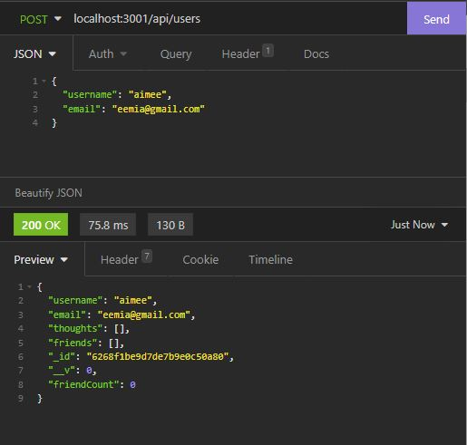

# social-network-api

## Description
    AS A social media startup, I WANT an API for my social network that uses a NoSQL database
    SO THAT my website can handle large amounts of unstructured data

---

## Table of Contents
- [Installation](#installation)
- [Usage](#usage)
- [License](#license)
- [Contributing](#contributing)
- [Tests](#tests)
- [Questions](#questions)

---

## Installation
- Clone the repo, download the packages with 'npm install' in the command line and start the database with 'npm start'

## Usage
- To have a quick NoSQL database to input continuously changing data

## First Look

## WalkThrough
[Click to open video]()

## Contributing
- Third-party Assets: MongoDB, Mongoose, Express, Node

## Questions
>Aimee Truong
>
>[My GitHub Profile](https://github.com/aimtruong)
>
>Email me at nttruong00@gmail.com if you have any additional questions!

    
